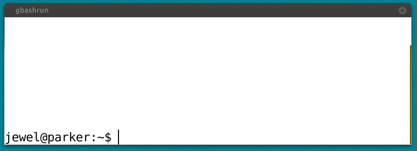

Gnome Bash Run Dialog
=====================

This is a replacement for the run dialog with full bash completion.

It requires the gtk3 ruby bindings, which can be installed with:

`apt-get install ruby-gtk3`

OR

`gem install gtk3`

