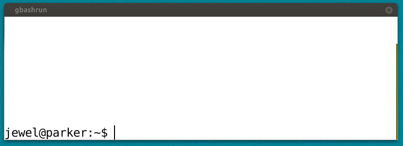

Gnome Bash Run Dialog
=====================

This is a replacement for the run dialog with full bash completion.



## Install build dependencies (Ubuntu/Debian)

```bash
apt install build-essential pkg-config libgtk-3-dev
```

## Build

```bash
make
```

## Run

```bash
./gbashrun
```
